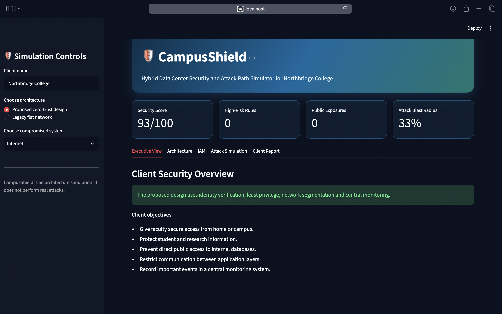
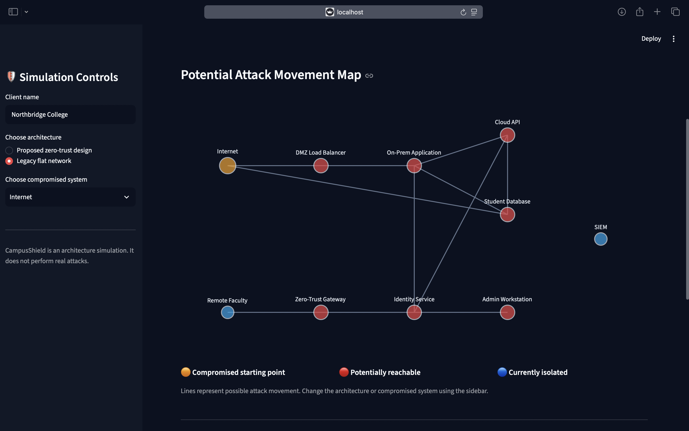
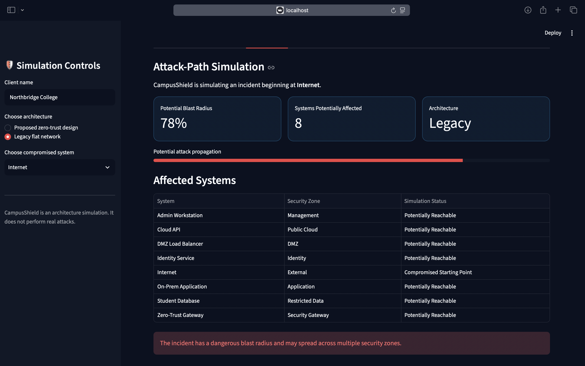
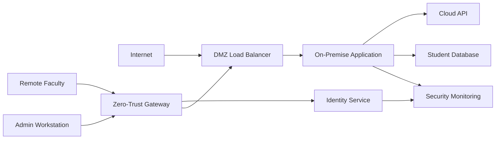

# 🛡️ CampusShield

## Hybrid Data Center Security and Attack-Path Simulator

CampusShield is an interactive cybersecurity architecture prototype designed for a college IT department operating applications across an on-premise data center and a public cloud.

The application compares a legacy flat network with a proposed zero-trust architecture, calculates potential attack movement, evaluates identity and network controls, and generates a downloadable client security assessment.

> **Project status:** Functional interview-ready prototype  
> **Live demonstration:** [Open CampusShield](https://campusshield-security.streamlit.app)

## Application Preview

### Executive Dashboard



### Legacy Network Architecture



### Attack-Path Simulation



## Client Scenario

Northbridge College operates teaching applications, research services and student-information systems across a private data center and public cloud.

Faculty members require secure access from both home and campus. Application developers, network engineers, platform engineers and security analysts also require different levels of access.

The college needs a design that:

- Supports secure hybrid-cloud communication.
- Prevents direct public access to sensitive databases.
- Restricts lateral movement after a compromise.
- Applies least-privilege identity access.
- Supports remote faculty access with MFA.
- Sends security events to centralized monitoring.
- Remains manageable for the existing IT team.

## Proposed Solution

CampusShield models a zero-trust hybrid architecture containing:

- Zero-Trust Gateway
- Identity Service
- DMZ Load Balancer
- On-Premise Application
- Public Cloud API
- Restricted Student Database
- Administrative Workstation
- Remote Faculty Access
- Central SIEM Monitoring

Network access is denied by default. Only explicitly required connections between systems and ports are permitted.

## Main Features

### Executive Security Dashboard

Displays:

- Security score
- Number of high-risk network rules
- Public sensitive-system exposures
- Potential attack blast radius

### Architecture Comparison

Users can switch between:

1. Proposed zero-trust design
2. Legacy flat network

The dashboard automatically recalculates security results.

### Interactive Attack-Path Simulation

Select a compromised system and view:

- Potentially reachable systems
- Calculated blast-radius percentage
- Affected security zones
- Incident containment status
- Recommended response actions

The calculation uses a directed graph and graph-reachability analysis.

### Interactive Network Diagram

The diagram uses:

- Orange for the compromised starting point
- Red for potentially reachable systems
- Blue for currently isolated systems

It updates when the architecture or starting system changes.

### Network Security Policy

The policy matrix documents:

- Connection source
- Connection destination
- Protocol
- Port
- Business purpose
- Risk level

Legacy rules demonstrate risks such as unrestricted ports, public database access and broad internal trust.

### Identity and Access Management

The IAM matrix separates responsibilities for:

- Faculty members
- Application developers
- Network engineers
- Kubernetes engineers
- Security analysts
- Cloud administrators

Sensitive access requires MFA, time-limited permissions or dual approval.

### Client Security Report

CampusShield automatically produces downloadable:

- Security assessment report
- Network-policy CSV file

The report updates when the architecture or compromised system changes.

## Architecture



## Security Principles Demonstrated

| Principle | CampusShield implementation |
|---|---|
| Zero trust | No implicit trust based only on network location |
| Least privilege | Each role receives only the required permissions |
| Default deny | Unlisted network connections are denied |
| Micro-segmentation | Application, identity, management and data zones are separated |
| Strong authentication | MFA and hardware-backed authentication protect sensitive roles |
| Workload identity | Applications use service identities instead of human passwords |
| Central monitoring | Authentication and application logs are sent to a SIEM |
| Incident containment | Attack reachability is measured as a blast radius |

## Technology Stack

- Python
- Streamlit
- Pandas
- NetworkX
- Plotly
- GitHub
- Streamlit Community Cloud

## Run Locally

### 1. Clone the repository

```bash
git clone https://github.com/YOUR_USERNAME/campusshield.git
cd campusshield
```

### 2. Create a virtual environment

```bash
python3 -m venv .venv
source .venv/bin/activate
```

### 3. Install dependencies

```bash
python -m pip install -r requirements.txt
```

### 4. Start the application

```bash
python -m streamlit run app.py
```

Open `http://localhost:8501` in a browser.

## Project Structure

```text
CampusShield/
├── .streamlit/
│   └── config.toml
├── .gitignore
├── app.py
├── README.md
└── requirements.txt
```

## Ethical and Technical Limitations

CampusShield is a defensive architecture and decision-support prototype.

It does not:

- Exploit vulnerabilities
- Scan external systems
- Inspect real network traffic
- Use real student information
- Replace a production penetration test
- Prove that every reachable system would be compromised

A production implementation would require cloud configuration reviews, firewall validation, vulnerability assessment, monitoring integration, recovery testing and formal security approval.

## Future Improvements

- Generate AWS security-group configuration.
- Generate Kubernetes NetworkPolicy YAML.
- Import architecture rules from CSV.
- Add MITRE ATT&CK technique mapping.
- Store simulation history.
- Export a styled PDF assessment.
- Connect to a test cloud environment.
- Add automated policy validation.

## Developer

Developed by **Vasvi** as a client-focused cybersecurity architecture project.
